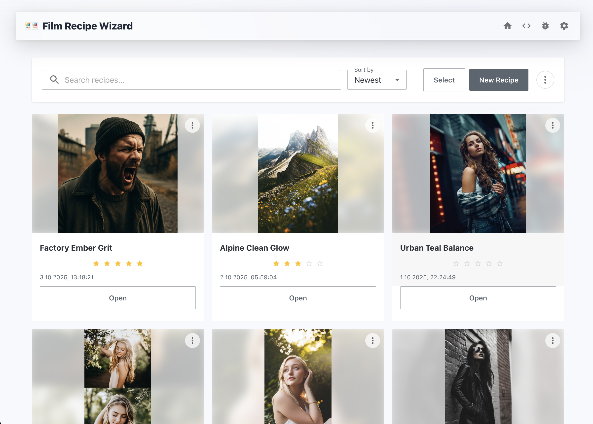
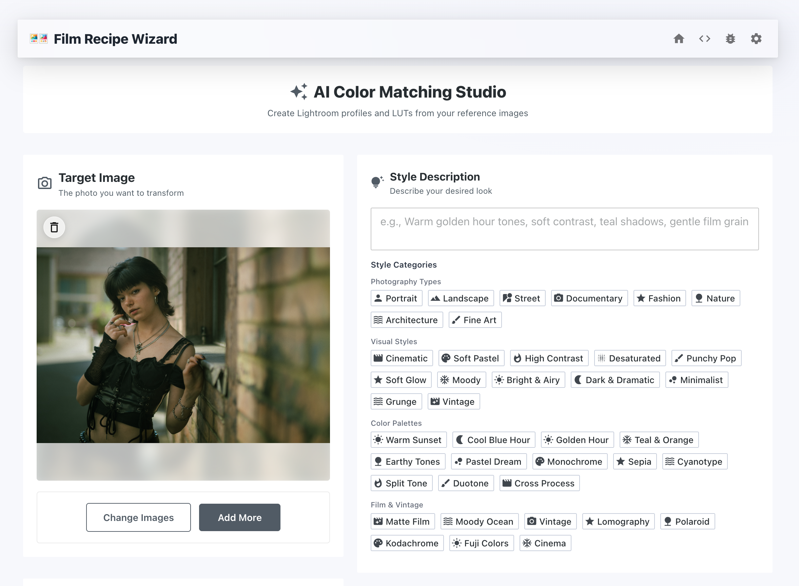

# Film Recipe Wizard - AI Color Grading & Film Emulation Tool

> **Professional Lightroom Presets & LUTs with AI-Powered Film Simulation**

**Missing Fujifilm simulations in Lightroom? Film Recipe Wizard is your solution.** Transform your photography workflow with intelligent AI-driven color grading that recreates authentic film looks, professional artistic styles, and custom color recipes. Generate industry-standard Lightroom XMP presets and 3D LUTs from reference photos or choose from dozens of built-in film emulations including Kodak, Fuji, Ilford, and cinematic stocks.

## 📸 Screenshots

### Main Interface & Color Matching

*AI-powered color analysis and film emulation interface*

### Film Presets & Processing Options  

*Comprehensive film simulation library and processing controls*

### Export & Results

*Lightroom XMP presets and 3D LUT export options*

### AI Chat Recipe Alteration

*Interactive chat interface to modify and refine film recipes with AI assistance*

## 💻 Installation

### For Users (No Coding Required)

**Simply download and install the app:**

1. **Download** the latest version from [GitHub Releases](https://github.com/tesenwein/filmRecipeWizard/releases/latest)

   - **macOS**: Download the `.dmg` file (Universal - works on Intel and Apple Silicon Macs)
   - **Windows**: Download the `.exe` installer (x64)

2. **Install** the downloaded file:

   - **macOS**: Open the `.dmg` file and drag the app to your Applications folder
   - **Windows**: Run the `.exe` installer and follow the setup wizard

3. **Launch** the app and add your [OpenAI API key](https://platform.openai.com/login) in Settings

## ✨ Color Grading Features

### 🎨 **Professional Color Matching**
- **AI-Powered Analysis**: Upload reference photos to extract color characteristics
- **Smart Target Processing**: Apply extracted color styles to your target images
- **Full AI Capabilities**: AI has access to all color grading tools including masks, HSL adjustments, tone curves, and point color corrections
- **Reference Image Support**: Multiple format support (JPG, PNG, WebP)

### 🎬 **Film Emulation & Lightroom Presets**
Perfect for photographers seeking **Fujifilm film simulations for Lightroom** and classic film looks unavailable in Adobe's default profiles.

**Color Negative Film Presets:**
- **Kodak Portra Series**: Portra 400, 160, 800 (warm skin tones, wedding photography)
- **Kodak Consumer Films**: Gold 200, UltraMax 400, ColorPlus 200, Max 400 (nostalgic film look)
- **Kodak Ektar 100**: Ultra-vivid landscape photography colors
- **Fujifilm Color Negative**: Superia 200/400/800, Pro 400H, C200, Pro 160NS (cool greens, pastel fashion tones)
- **Agfa Vista Series**: Vista 200, 400 (European vintage warmth and character)
- **Lomography Films**: Color 400, 800, Metropolis, Lady Grey (creative experimental looks)

**Color Positive (Slide) Film LUTs:**
- **Kodachrome Series**: 25, 64 (legendary rich reds, deep blacks, vintage travel photography)
- **Fujifilm Velvia Series**: 50, 100, original variants (super-saturated nature and landscape photography)
- **Fujifilm Provia Series**: 100F, 400X (neutral professional slide film)
- **Fujifilm Astia 100F**: Soft contrast portrait and fashion photography  
- **Kodak Ektachrome Series**: E100, 100VS (modern digital-friendly slide clarity)
- **Consumer Slides**: Fuji Sensia 100, Agfa CT Precisa 100 (affordable slide film options)

**Black & White Film Presets:**
- **Kodak Tri-X 400**: Classic street photography grain and contrast
- **Ilford HP5 Plus 400**: Versatile documentary photography tones
- **Kodak T-MAX Series**: 100, 400, 3200 (modern tabular grain sharpness)
- **Fuji Acros 100 II**: Ultra-fine grain for detailed B&W work
- **Ilford Delta Series**: 100, 400, 3200 (modern T-grain technology)
- **European Classics**: Agfa APX 100, Foma Fomapan 100, Kentmere 400
- **Specialty Films**: Rollei Retro 80S, Fuji Neopan 400 (unique tonality options)

**Cinematic Film LUTs:**
- **Kodak Vision3 Series**: 200T, 250D, 500T (tungsten and daylight cinema stocks)
- **CineStill Series**: 50D, 400D, 800T (remjet-removed cinema film for still photography)
- **Fuji Eterna Series**: 250D, 400T (warm cinema tones for video color grading)

### 🎭 **Artistic Styles**
**Portrait Styles:**
- Annie Leibovitz, Peter Lindbergh, Steve McCurry, Platon, Irving Penn
- Richard Avedon, Helmut Newton, Mario Testino, Patrick Demarchelier
- Bruce Weber, David Bailey, Nadav Kander (dramatic to minimalist styles)

**Landscape Photography:**
- Ansel Adams, Galen Rowell, Michael Kenna, Sebastião Salgado
- Peter Lik, Edward Burtynsky, Alexey Mishkin, Joe Cornish
- Classic to modern landscape photography aesthetics

**Street Photography:**
- Henri Cartier-Bresson, Fan Ho, Daido Moriyama, Vivian Maier
- Joel Meyerowitz, Garry Winogrand, Robert Frank, Lee Friedlander
- Helen Levitt, Gordon Parks (classic to contemporary street styles)

**Fashion & Editorial:**
- Steven Meisel, Guy Bourdin, William Klein, Tim Walker
- Ellen von Unwerth (high-fashion to avant-garde editorial styles)

**Instant Film Styles:**
- Polaroid Classic, Modern (classic and contemporary instant aesthetics)
- Fuji Instax (modern instant film looks)

### ⚙️ **Fine-Tune Controls**
**Essential Adjustments:**
- **Temperature** (-50 to +50): Cool to warm color balance
- **Contrast** (0-100): Shadow and highlight separation
- **Tint** (-50 to +50): Magenta to green color cast
- **Vibrance** (0-100): Smart saturation enhancement
- **Saturation** (0-100): Global color intensity

### 🔧 **Processing Options**
- **Film Grain**: Add authentic film texture
- **Lightroom Profiles**: Adobe Color, Adobe Monochrome, Flat Profile base
- **Custom Vibes**: Cinematic, Soft Pastel, and other mood presets

### 📤 **Export Formats & Compatibility**
- **Lightroom XMP Presets**: Direct import to Adobe Lightroom Classic & CC
- **3D LUTs (.cube)**: Compatible with Premiere Pro, Final Cut Pro, DaVinci Resolve, After Effects
- **Batch Processing**: Process up to 3 target images simultaneously
- **Cross-Platform**: macOS (Intel & Apple Silicon) and Windows support

### 🎯 **Perfect For**
- **Wedding Photographers** seeking consistent Portra-style skin tones
- **Portrait Photographers** missing Fuji film simulation presets in Lightroom  
- **Landscape Photographers** wanting Velvia saturation and Kodachrome richness
- **Street Photographers** recreating classic Tri-X and HP5 black & white looks
- **Content Creators** needing cinematic color grading for video projects
- **Film Photography Enthusiasts** digitizing analog aesthetics

## 🚀 Quick Start

1. **Setup**: Add your [OpenAI API key](https://platform.openai.com/api-keys) in Settings
2. **Create**: Upload target photos and describe your desired style
3. **Export**: Generate Lightroom XMP presets or 3D LUTs for your workflow

## ⚠️ macOS Installation Note

When installing on macOS, you may encounter a security warning that the app "cannot be opened because it is from an unidentified developer." This is because the app is not yet signed with an Apple Developer certificate.

**To install:**

1. Download the app normally
2. When you see the security warning, click "Cancel"
3. Go to **System Settings** → **Privacy & Security**
4. Find the app in the security section and click **"Open Anyway"**
5. Alternatively, right-click the app and select **"Open"** while holding the Control key

This is a standard macOS security feature for unsigned applications. The app is safe to use and open source.

## 📄 License

MIT License - see [LICENSE](LICENSE) file for details.

## 🤝 Help Welcome

We welcome contributions, bug reports, and feature requests! Please see our [Contributing Guide](CONTRIBUTING.md) or [open an issue](https://github.com/tesenwein/filmRecipeWizard/issues).

---

_Made with ❤️ for photographers, by photographers_
